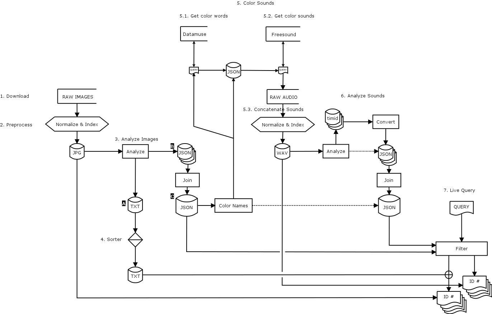

# mmdb



## Multimodal Database

`mmdb` https://github.com/fdch/mmdb is a multimodal database system geared towards live querying of image an audio. A multimodal database combines two sensing modes. In this sense, the camera sensor and the microphone. 

The system here enables you to load a folder with images with various formats and sizes, analyze them, and output a database describing the images with some useful keywords (descriptors). The images can be either taken and collected by you, obtained from the web, or generated by some other means. The analysis is done after normalizing these images to the same size and format in a pre-processing step.

After the analysis is done, the database obtained is divided into two types. The first type is a very small text file with only a handful of values that describe a few things of the image. This file is useful to sort all images based on some or all of these values. The second type is a semi-structured JSON file that includes a lot of data referring to each image. This second file is then used for a set of purposes. On the one hand, we can use this database to perform queries based on those values and obtain desired images. For example, we can ask for bright images, or images with faces or bodies, or images with lots of blobs, etc. On the other, from this database we obtain a set of color words (English color names) of the most present colors on each image. These color words become the link between image and audio in a process that goes as follows. First, we use these color words to query related nouns to those colors using an online database called Datamuse.com. Then, from this query, we obtain another database that has all of these colors and nouns. Finally, this intermediary database that has only text is used to query Freesound.org, to match and download sounds related to those words. Once we have our folder with downloaded audio files from Freesound, we concatenate all of these sounds in sound files named with their respective color words.

Now we can use our audio and image databases to perform a simultaneous query to both, and display this live as an audio/visual stream. The live query is made with a matching matrix that equates certain image descriptors with some audio descriptors. For example, images with faces and bodies will match with audios with pitches on them, and images with many blobs will match with noisier sounds.


## Steps


### 1. Download
	
Download image dataset (raw, original files) into `raw` directory.

-------------------------------------------------------------------------------


### 2. Preprocess

`sh preprocess`

Resize, rename, and/or convert raw images into `img`, `vid`, and `aud` directories. This step needs [ffmpeg](https://ffmpeg.org/ffmpeg.html) and [sips](https://ss64.com/osx/sips.html)


-------------------------------------------------------------------------------


### 3. Analyze Images

`sh analyze`

Output two files: an entry file and a data file

#### A

Entry file contains one entry per image file holding the following data: 

  -	brightness: variance of the image histogram
  -	bodies    : number of bodies found (haarcascades)
  -	faces     : number of faces found (haarcascades)
  -	cvblobs   : number of cvblobs found
  -	lines     : number of hough lines found
  -	circles   : number of hough circles found
  -	keypoints : number of keypoints (corners) found

#### B

`JSON` data files contains one entry per image file holding the actual data

[mean_col (x), histo (64), bodies (x), faces (x), cvblobs (x), lines (x), circles (x), keypoints (x)]

#### Optionally:

Define a ROI using the `roi.pd` patch, and then set the ROI flag to 1 before running `sh analyze`


-------------------------------------------------------------------------------


### 4. Sorter

`sh sorter`

Use A to sort files based on any given field, and pairs of fields

Output sorted files into `*-sorted.txt` where each line contains
the sorted inidices of each image filename.


-------------------------------------------------------------------------------


### 5. Color Sounds

Obtain a sound database based on image colors. This is broken down in four steps: 

#### 5.1. Get color words:

`python src/colors.py`

First, this script places all data objects (B) inside an array of objects in one `JSON` object (C) (Concatenates `JSON` files into one)

This script gets English names of the clustered colors in the `JSON` data base (C), and outputs a file `./data/colorwords.json` containing one entry per unique color. The structure is like this: `name`, `idlist`, and `words`. 

- `name` : has the English name of the color, e.g. 'blue'
- `idlist`: has all the image ids that have that color
- `words`: has nouns related to such color. These nouns are obtained by querying [datamuse](https://datamuse.com), e.g. 'sky, eyes, etc.'

#### 5.2. Get color sounds:

The file `./data/colorwords.json` is then used to query [Freesound](https://freesound.org) and download sounds related to all `words` and `name`s using:

`python src/fs_download.oy`


NOTE: some colors may not result in words that have a related sound to them.


#### 5.3. Concatenate sounds:

Concatenate color sounds into same files and name the file with the image id:

`python src/concat_sounds.py`

This script runs `ffprobe` to ignore files that might not be audio, or that might be malformed. It then runs `ffmpeg` to concatenate all the audio related to a color name into a file named with that same color name.


-------------------------------------------------------------------------------


### 6. Analyze Sounds

`sh analyze_sounds.sh`

This script runs the `analyze_sounds.pd` file in batch mode. It analyzes sounds in a given directory, and places all `*.timid` files in a second directory. Optionally, you can analyze only one file by index into the directory with a 3rd argument. 

By default, the analysis is outputted both in `*.timid` and in `*.json` (using `timid2json.py`), and it concatenates all `JSON` files into one database.

#### Instance Structure

The first nine features are single-valued, so one float each. The last two features default to 50 values each, representing the bins of the bark scale with a filterbank spaced at 0.5. You can edit this and other parameters on the parameters file (open `analyze_sounds.pd` to do this). The instance length would change accordingly. The output analysis file is one per each audio file, with the following instance structure:

1. barkSpecSlope
2. barkSpecKurtosis
3. barkSpecSkewness
4. barkSpecBrightness
5. barkSpecFlatness
6. barkSpecRolloff
7. barkSpecCentroid
8. barkSpecSpread
9. barkSpecIrregularity
10. bfcc
11. barkSpec (used for all of the above, internal window size is 512)

(see help files for [timbreID](https://github.com/wbrent/timbreID))

The default analysis window size is 4096, so in one second of file at 44100, you will have around 10 instances, which is ok for many purposes, but you can change this. On the one hand, you can specify overlaps (default 1, no overlap). On the other, you can define an analysis average factor **f** (default 8). This factor is used to average several smaller sized analysis into one. To do this, we simply take the mean of **f** consecutive analysis frames within the larger analysis window size. 


-------------------------------------------------------------------------------


### 7. Live Query

This enables you to perform live queries to both images and audio simultaneously, using the same query parameters and a matching matrix.

#### Instructions to open this patch:

Run on three separate terminals:

1. ``sh audio`` (for the sounds)
2. ``sh display`` (for the images)
3. Run the live database: ``python src/live_query.py ./txt/images-entries.txt ./data/images-data.json ./data/audio-data.json ./data/colorwords.json 5011 localhost``
4. Now open `live_query.pd`


#### Matching matrix

| Image Feature         | Audio Feature                       |
| --------------------- | ----------------------------------- |
| thres_{R,G,B}         | audio database                      |
| thres_C               | audio database                      |
| {bodies, faces}       | Kurtosis                            |
| {bodies, faces}[size] | Skewness                            |
| brightness            | Slope                               |
| smoothness\*          | grain size (for concatenation)      |
| cutness\*             | grain size (for concatenation)      |
| blobiness             | Brightness, Flatness, Rolloff       |
| skewness\*            | grain location (for spatialization) |
| boundedness           | Centroid, Spread                    |
| kontrastedness        | Irregularity                        |


(\*) Not used in the audio query


## Extra

### Reader / Visualizer

```
cd bin
pd reader.pd
```
This patch can be used to visualize the `JSON` data files (B)


-------------------------------------------------------------------------------

### Image Query (non-realtime)

```
cd bin
pd query.pd
```

NOTE: This patch is a gui for `src/query.py`.

This patch can be used to:

-  perform a query to the `JSON` database (C) to get indices, based on 
-  multiple descriptors (color, brightness, smoothness, blobiness, etc.), 
-  visualize the queries for live editing with the `sh display` program

Both input query and its results are stored on `JSON` files for later use.


-------------------------------------------------------------------------------

## Dependencies

### Externals

I have not included binaries within this repo, but you can download the following externals:

Available via `deken`:
 
- Gem
- pix_opencv
- purest_json
- ggee
- timbreID
- zexy/repack

Available via github:

- [fd_lib](https://github.com/fdch/fd_lib) for [iterate], [counter]

### Abstractions

In the `bin/lib` directory there are some abstractions made for this repo (prepended with a `_`. I also have included these together with some other abstractions as well in the `pdbin` directory that are taken from [fd_lib](https://github.com/fdch/fd_lib) and other places. `pdbin` might not be necessary if you have already installed all the external libraries mentioned above. NOTE: the `pdbin` directory is not necessary to load the patches, it is just placed there for convenience. Just declare it with `[declare -path ../pdbin]` if you need to use it.

-------------------------------------------------------------------------------
	
## To do

- implement continuity for images (using histogram clusters)
- filters of type `NOT` in `query.py`
- match **histograms** with **bfcc** ?
- convert image-data.json to matching matrix parametes to calculate distance between audio-data.json
